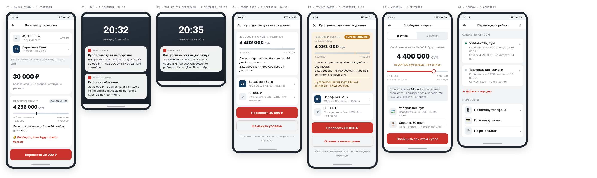
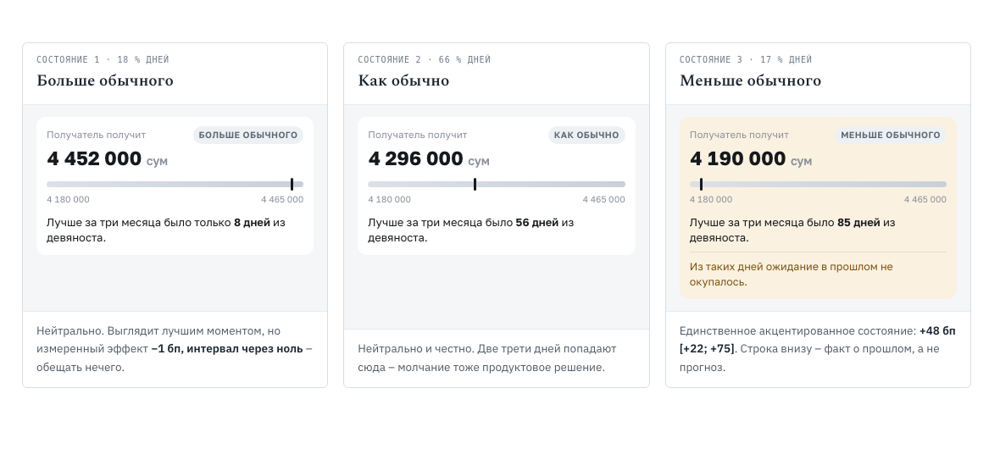

# Дизайн интерфейса: индикатор, пуш, оповещение об уровне

Три компонента, которые надо добавить к существующему флоу перевода за рубеж.
Ни одному из них не нужен прогноз курса — это следствие результатов, а не
дизайнерское предпочтение.

Исходник макетов — `design/interfeys.html`, он же собирает картинки этого
документа через `make_mockups.py`. Данные на экранах вымышленные: имена, номера,
остатки, реквизиты и банки получателя.



---

## 1. Главное решение: цвет работает против интуиции

Напрашивающийся дизайн — светофор «зелёный, когда курс выгодный». Мы его
измерили, и он не подтверждается.

| Состояние курса | Доля дней | Достижимая выгода | 95 % ДИ | Что можно сказать |
|---|---:|---:|---|---|
| Сум дают больше обычного | 18 % | −1 бп | [−26; +24] | только факт |
| Как обычно | 66 % | −7 бп | [−17; +4] | только факт |
| **Сум дают меньше обычного** | 17 % | **+48 бп** | **[+22; +75]** | факт + строка про прошлое |

Источник — `run_product_numbers.py`, блок «светофор», вывод в
`submission/10-produktovye-chisla.md`. Границы бакетов 10 и 90 заданы кейсом,
а не подобраны нами. Тот же расчёт только по тестовым годам даёт те же знаки и
тот же порядок: −3 бп [−31; +26], −8 бп [−20; +3] и **+51 бп [+23; +77]** — вывод
не держится на обучающем периоде.

**Значимо ровно одно состояние из трёх — и это то, которое клиенту выглядит
худшим.** Состояние «за рубли дают много сум», которое кажется отличным
моментом, даёт −1 бп с интервалом через ноль: обещать там нечего.

Отсюда раскраска: **два состояния из трёх нейтральны** и несут только факт о
положении курса, акцентируется одно. Зелёного «отличный момент» в интерфейсе нет
вообще — он обещал бы то, чего мы не измерили.



### Почему на шкале одна величина, а в тексте другая

Полоска показывает **положение в квартальном диапазоне** — где курс между
минимумом и максимумом. Текст называет **процентиль** — долю дней, которые
сегодняшний курс побивает. На выбросах они расходятся: один старый пик на краю
окна сдвигает диапазон целиком, не трогая процентиль.

Разрешённая кейсом формулировка «выгоднее, чем в 85 % дней» обещает именно
процентиль. Считать одно, а писать про другое нельзя — поэтому в коде это два
разных признака, `pct_range_90` и `days_beaten_90`, и тест
`test_position_in_range_and_percentile_disagree_on_an_outlier` показывает вход,
где они расходятся на 80 пунктов.

---

## 2. Индикатор на экране суммы

Флоу перевода за рубеж уже существует: счёт → номер получателя → банк →
назначение → сумма. Виджет встаёт на последний шаг — там, где принимается
решение и где сумма уже конкретная. **Новых шагов не добавляется ни одного.**

| Решение | Почему так |
|---|---|
| Величина в сумах, а не в курсе | «69,8 ₽ за 10 000 сум» клиенту ничего не говорит. «Получатель получит 4 296 000 сум» — говорит, и это та же цифра, которую он назовёт семье |
| Виджет ниже суммы, а не выше | Пока сумма не введена, показывать нечего: вся ценность в переводе базисных пунктов в сумы |
| Шкала без цветовой заливки | Градиент «красное → зелёное» означал бы, что один конец хороший. По нашим данным это неправда для двух состояний из трёх |
| Кнопка перевода не меняется | Никакого «Перевести сейчас — выгодный курс!». Индикатор информирует уже сформированное намерение, а не подталкивает |
| Единственная ссылка ведёт в оповещение | Ответ на вопрос «что мне делать, если сейчас невыгодно». Без неё честное «подождите» — повод уйти из приложения |

---

## 3. Пуш и посадочная страница

Два типа пуша, и они принципиально разные по происхождению.

**Пуш 1 — уровень, который задал клиент.** Прогноза не требует вовсе: это факт
наступления события, которое клиент сам назначил. Поэтому он и должен быть
основным типом — его текст не может нарушить рамку кейса, потому что в нём нет
утверждения ни о чём, кроме настоящего.

> Курс дошёл до вашего уровня. За 30 000 ₽ сейчас дают 4 402 000 сум.
> Вы просили сообщить при 4 400 000.

**Пуш 2 — сигнал триггерной модели, и он не проверен комплаенсом.** Правило
`pct_range_90 >= 95` срабатывает на 99-м процентиле квартального диапазона —
когда валюта получателя **дорога** и клиент получает меньше сумов. Разрешённая
кейсом формулировка «выгоднее, чем в N % дней» превращается там в «хуже, чем в
99 % дней» и перевода не мотивирует; единственный мотивирующий текст —
утверждение о будущем — запрещён. Это тот самый вывод, который комплект называет
главным: **у оптимума метрики кейса нет допустимого текста**
(`08-dve-metriki-dve-modeli.md`, раздел 2).

Рамка «перестань ждать» — единственный найденный кандидат. Это факт о прошлом, и
направления он не обещает:

> Если вы ждали лучшего курса. За последние три месяца ожидание в такие дни
> в среднем не окупалось. Сейчас за 30 000 ₽ — 4 190 000 сум.

Частота правила — 0,60 на коридор в неделю, то есть **ниже обязательной полосы
1–2**. В полосу попадает только более широкий вариант `pct_range_90 >= 85`
(1,02 сигнала в неделю, lift 1,26).

**Чего в пушах нет:** «успейте», «курс вырастет», «лучший момент», «пока не
подорожало». Любой намёк на будущее — то же нарушение, что и прямое обещание.

### Что открывается после тапа

Не главный экран и не общий список переводов, а **предзаполненный перевод по
тому коридору, о котором был пуш** — с раскрытым виджетом, подставленными
получателем и суммой.

| Решение | Почему так |
|---|---|
| Заголовок повторяет пуш дословно | Клиент должен увидеть, что попал туда, куда его звали. Расхождение — частая причина отказа на посадочной |
| Получатель уже подставлен | Оповещение заводится на конкретный коридор и обычно на конкретного получателя |
| «Изменить уровень» равноправна с переводом | Клиент может решить подождать ещё. Это нормальный исход, и он должен остаться внутри продукта |
| Предупреждение о курсе исполнения | Сигнал считается по курсу ЦБ, перевод пройдёт по курсу приложения. Разрыв называем прямо |
| Никакого таймера и обратного отсчёта | Срочность — это утверждение о будущем в чистом виде |

---

## 4. Оповещение о достижении уровня

Самая сильная часть предложения и самая дешёвая: **порог задаёт клиент**,
поэтому прогноз не нужен ни в каком виде. Это же закрывает главную дыру
продукта — честное «сейчас невыгодно» перестаёт быть поводом уйти.

| Решение | Почему так |
|---|---|
| Порог в сумах, а не в курсе | Клиент мыслит суммой, которую получит семья. Переключатель «в рублях» есть, но не по умолчанию |
| Ползунок ограничен реальным диапазоном квартала | Уровень, которого никогда не было, дал бы оповещение, которое не сработает никогда |
| **Частота уровня названа заранее** | «Такой курс был в 16 % дней — примерно раз в неделю». Калибровка ожидания, снова фактом о прошлом |
| **«Мы не знаем, будет ли он снова»** | Одна строка, честно закрывающая рамку кейса. Превращает ограничение в доверие |
| Срок жизни 30 дней с переспросом | Бессрочное оповещение через полгода станет спамом по забытому поводу |

### Где это лежит в навигации

Три входа, и ни один не требует нового пункта в нижнем меню — пять пунктов уже
заняты, а курсовые оповещения это функция внутри переводов, а не раздел.

1. **Из виджета на экране суммы** — момент, когда клиент увидел курс и решает.
   Ведёт сюда с уже подставленным коридором и суммой.
2. **Платежи → Переводы за рубеж** — раздел уже существует. Список активных
   оповещений становится его первым блоком, до плитки самих переводов.
3. **Карточка на Главном** — появляется, только когда оповещение активно, и
   показывает расстояние до уровня. Нет активных — нет карточки.

---

## 5. Что этот дизайн даёт и чего не даёт

| Компонент | Механизм ценности | Нужен прогноз | Что меряет пилот |
|---|---|---|---|
| Индикатор на экране суммы | доверие, удовлетворённость | нет | доля отказов на экране суммы |
| Оповещение об уровне | удержание отложенного намерения | нет | возвраты в приложение, конверсия по пушу |
| Сигнал триггерной модели | остановка ожидания | нет | инкрементальная конверсия против холдаута |
| Прогноз направления курса | — | да | **в продукт не берём** |

### Три вещи, которые дизайн не решает

**Курс приложения — не курс ЦБ.** Все цифры на макетах считаются по ряду ЦБ, а
перевод пройдёт по курсу поставщика ликвидности. Пока разрыв не измерен, строка
«курс может измениться до подтверждения» обязательна на экране подтверждения —
там, где сумма становится обязывающей. На остальных экранах сумма справочная, и
повторять оговорку пять раз значит превратить её в шум, который никто не читает.

**Продуктовые обещания на макетах не проверены.** «Без комиссии», «зачисление в
течение одной минуты через СБП» и «у переводов нет выходных 31 декабря» взяты как
правдоподобные, но ни один из них мы не подтверждали по каждому из пяти
коридоров. До пилота каждое должно быть либо подтверждено, либо снято: реклама
финансовой услуги, умалчивающая об условиях, — отдельный регуляторный риск.

**Доля клиентов, способных отложить перевод, неизвестна.** Если гибких десять
процентов, пилот на всей базе покажет ноль из-за разбавления — при полностью
работающем продукте. Таргетинг нужен с первого дня.

**Сумма фиксируется к отправке или к получению — вопрос без ответа.** Если к
получению, лучший курс означает меньше отправленных рублей, и знак влияния на
выручку банка меняется на противоположный. От этого зависит, продаём мы продукт
как рост выручки или как удержание.

---

## Как пересобрать макеты

```bash
.venv/bin/python make_mockups.py    # design/interfeys.html → figures/06,07 в PNG и PDF
```

Картинки собираются из того же файла, который открывает человек в браузере.
Иначе макет в документе и макет в исходнике расходятся молча — ровно так же, как
расходятся захардкоженные числа и свежий прогон.
